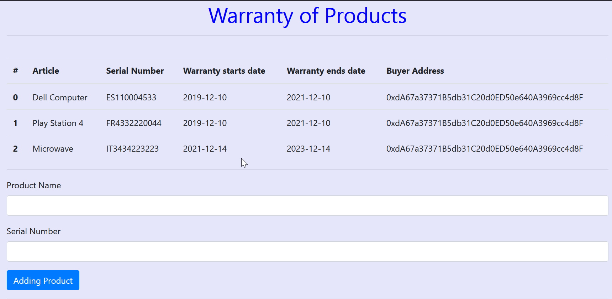
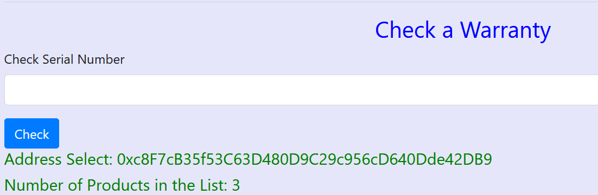
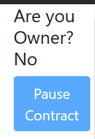
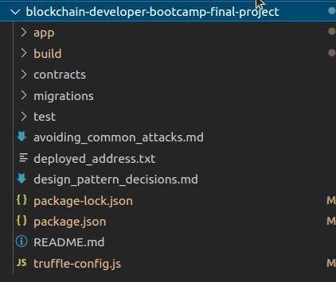

# Activate Warranty for consume products

**Summary**

The theme for the Dapp is a system that activates in the BLockchain the warranty of a product, You can justify that the product is still under warranty. Using the Serial number, and the name of the product. 
Activating the guarantee from the moment the product is uploaded until the next two years. In this way, product buyers could justify their purchase and have access to the Manufacturer's Warranty.

**Quick Overview**

In the Apllication there are 3 diferents areas:

1 Main area, where the table with all the Uploaded Products are visible. And the option to Upload a Product using a Serial Number and a Name


2 Check Warranty Area, where is possible to check if an existing Product is Still under the 2 years Warranty. 
In the Bottom of the Screen there is a Log view to know the Address that is conected to the Dapp, and see some Status during interaction.


3 Circuit Breaker, Paused and Unpaused the contract, so no one can upload any Product to the contract in case any security reason, and Activate it again if need it. This option only the Owner of the contract can do it. You can see a log message to check if you are the Owner or not.




# Directory Structure



 Video showing Dapp:
=======

# Smart Contracts points

- [Avoiding Common Attacks](./avoiding_common_attacks.md)
- [Design Pattern Decisions](./design_pattern_decisions.md)


# Testing the DApp in Rinkeby Network

The Smart Contract is available and deployed in the Rinkeby network using Infura
The Front end is deployed on a Repository using Github Pages

https://jcmoya.github.io/frontEnd_Dapp_Warranty/


To see more details about Contract Deployment:
[Rinkeby Truffle](others/Rinkeby_deploy_log)


# Steps for testing the DApp in a Local enviorment

Dependencies and Aplications need it to run the Dapp:

- Node Package management (npm).
- Solidity, compiler used "0.5.8+commit.23d335f2.Emscripten.clang"
- Truffle: To Deploy Smart Contract.
- Ganache: For using a Local Blockchain and do some tests.
- Metamask: To interact with the BLockchaing and be able to sing transactions

**1. Clone the project**

`https://github.com/jcmoya/blockchain-developer-bootcamp-final-project`


**2. Start Ganache**
Run Ganache
```
./ganache-2.5.4-linux-x86_64.AppImage
```

**3. Using Open Zeppelin Libraries**

Install Open Zeppelin Dependencies inside the proyect folder in this way:

```
 npm install @openzeppelin/contracts

```

**4. Compile and Deploy contacts**

Deploy contract in Ganache: 

`$ truffle migrate ` 

**5. Arrancar Front End**

In folder app, open a terminal and write next:
`$ npm install`

and launch the web
`$ npm run dev`


# Test Phase

There are 5 Tests done for the main contract, using truffle test in a terminal will launch:

```
  Contract: Garantia
    ✓ Check that the Builder's Guarantees are added (155ms)
*****************************************************************
Product: Dell Computer-----Serial number: ES110004533---Starts Date: 2019-12-12
*****************************************************************
*****************************************************************
Product: Play Station 4-----Serial number: FR4332220044---Starts Date: 2019-12-12
*****************************************************************
*****************************************************************
Product: Huawei P20-----Serial number: ES32754451---Starts Date: 2021-12-16
*****************************************************************
    ✓ Add new Warranty.. (1822ms)
    ✓ Check the validity of the Guarantees (212ms)
Resultado: Error: Returned error: VM Exception while processing transaction: revert You must introduce a Name and a Serial Number -- Reason given: You must introduce a Name and a Serial Number.
    ✓ Error, No Article name (2881ms)
Resultado: Error: Returned error: VM Exception while processing transaction: revert Serial number already activated!! -- Reason given: Serial number already activated!!.
    ✓ Error, Serial number already exist on the Table (240ms)


  5 passing (6s)

```


Public Ethereum Address for NFT Certification : 0x6644bBd4D99DD18aCcb3EF69229f6E293509FFE9

